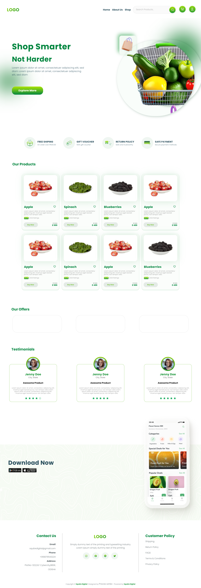

# Online Grocery Shopping Web Design Project

Welcome to the Online Grocery Shopping Web Design project, developed under the internship with squbix Digital. This project focuses on creating a user-friendly and visually appealing frontend for an online grocery shopping platform.

## Table of Contents

-   [Project Overview](#project-overview)
-   [Features](#features)
-   [Installation](#installation)
-   [Usage](#usage)
-   [Screenshots](#screenshots)
-   [Technologies Used](#technologies-and-materials-used)
-   [License](#license)

## Project Overview

This project is a part of the internship program at squbix Digital. The goal is to design and implement a responsive and intuitive frontend for an online grocery shopping website from the figma files. Users can browse through various product's, view application download advertisement, check out special offers, and read testimonials from satisfied customers & a footer section consist of Contact Us, Social links & Customer Policy Section.

## Features

-   Browse products.
-   Display special offers and discounts
-   Link to download the application.
-   Show testimonials from happy customers
-   Responsive design for optimal viewing across devices

## Installation

1. Clone the repository: `Extract the Archieve file` **shop.zip** `using 7zip, Winzrar or built in extract files option.`
2. Open the folder with VS Code.
3. Launch: `Install the Live server Extension`

## Usage

1. Click on the <kbd> Go Live </kbd> `button on the bottom-right corner on the index.html page.`

## Screenshots

## Technologies, and Materials Used

-   HTML5, CSS3, JavaScript
-   Figma Design's
-   High Defination's Images.
-   SVG Icons.

## License

All rights to this project are reserved.. Unauthorized use and distribution of the code, design, and other project materials are prohibited.

## Contact

For any inquiries, feel free to contact [pravaslenk20@gmail.com](pravaslenk20@gmail.com). Happy coding!

---
